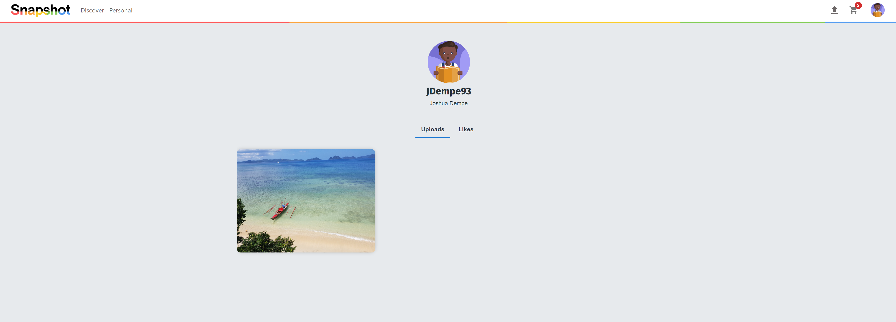

[](https://opensource.org/licenses/MIT)  


<p align="center"></p>

# Snapshot

## General Information

Snapshot is the ultimate platform for creators, enabling you to effortlessly share and showcase your photographs. Explore captivating new creations, purchase your favorite prints, and turn your passion into profit. Join Snapshot today and unleash your creativity to the world!

## Table of Contents

- [General Information](#general-information)
- [Deployed Site](#deployed-site)
- [Preview](#preview)
- [Demo](#demo)
- [Description](#description)
- [Technologies Used](#technologies-used)
- [Installation](#installation)
- [Usage](#usage)
- [Credits](#credits)
- [Contact](#contact)
- [License](#license)
- [How to Contribute](#how-to-contribute)

## Deployed Site

The deployed site can be found [here](https://snapshot-marketplace-a63592d12ba6.herokuapp.com/)!

## Description

Snapshot is a MERN full-stack application that allows users to create an account, upload photos, and sell them to other users. The major features of the application include:

- User authentication and authorization
- User profile creation
- Photo upload to Cloudinary cloud storage
- Photo purchase with various options for size and quantity
- Shopping cart
- Order history
- Commenting on photos

---

## Technologies Used

- [Heroku](https://www.heroku.com/) - Cloud platform for deploying and managing applications.
- [MongoDB](https://www.mongodb.com/) - NoSQL database for storing application data.
- [Mongoose v6.0.12](https://www.npmjs.com/package/mongoose) - Object modeling tool for MongoDB.
- [GraphQL v15.5.1](https://www.npmjs.com/package/graphql) - Query language for APIs.
- [Apollo Server v3.5.0](https://www.npmjs.com/package/apollo-server-express) - GraphQL server for Express.
- [Apollo Client v3.5.1](https://www.npmjs.com/package/apollo-client) - GraphQL client for React.
- [React v17.0.2](https://reactjs.org/) - JavaScript library for building user interfaces.
- [React Router v5.2.1](https://www.npmjs.com/package/react-router) - Routing and navigation for React apps.
- [node.js v18.12.1](https://nodejs.org/en) - A scalable server-side JavaScript runtime;
- [express v4.18.2](https://www.npmjs.com/package/express) - Web application framework for building server-side applications.
- [express-session v.17.3](https://www.npmjs.com/package/express-session) - Middleware for managing session data in Express.
- [nodemon v2.0.22](https://www.npmjs.com/package/nodemon) - Development tool for automatically restarting the server during code changes.
- [dotenv v16.0.3](https://www.npmjs.com/package/dotenv) - Loading environment variables from a .env file.
- [Stripe v8.167.0](https://www.npmjs.com/package/stripe) - Payment processing platform.

---

## Installation

There is no installation required. However, if you would like to run the application locally, follow the steps below:

### Prerequisites

- [Node.js](https://nodejs.org/en/)
- [MongoDB](https://www.mongodb.com/try/download/community)
- [Cloudinary Cloud Account](https://cloudinary.com/)

### Clone

Clone the [repository](https://github.com/JDempe/Snapshot) to your local machine.

### Setup

2. Navigate to the root directory of the cloned repository in your terminal.
3. Run `npm install` to install the dependencies.
4. Create a `.env` file in the root directory of the cloned repository. An example of the contents of the `.env` file is shown below:
   ```
   PORT = 3000
   REACT_APP_CLOUDINARY_NAME=your_cloudinary_name
   REACT_APP_UPLOAD_PRESET=your_upload_preset
   ```
5. Seed the database by running `npm run seed` from the root directory.
6. Start the full stack application by running `npm run develop` from the root directory.
7. Navigate to `http://localhost:3000` in your browser to view the site.

---

## Usage

### Discover

The application is deployed on Heroku and can be accessed [here](https://snapshot-marketplace-a63592d12ba6.herokuapp.com/). The application can also be run locally by following the steps outlined in the [Installation](#installation) section. To get started, the user must create an account. Once signed in, the user will be taken to the discover page, which displays other user photos in a Material UI Masonry style layout. Hovering over images will show the photographers name and the number of likes the photo has.

<p align="center"></p>

### Details

Clicking on a photo will route the user to the Details page for that specific photograph. The Details page is where the bulk of the applications features reside. The user can enlarge the image to closer inspect the photo, leave comments on the photo, and add the photo to their cart using multiple different sizes. The user will be able to like the photo in future releases, currently the number of likes is static and for display purposes only.

<p align="center"></p>

### Upload

The user can also navigate to the Upload page, where they can upload a photo to the site. They are required to input a title and description for the photo before it will be uploaded. Once uploaded, the photo is added to the Discover page and the user can navigate to the Details page for that photo.

<p align="center"></p>

### Cart

The cart can be accessed any time the user is logged in from the navigation bar. WHen items are added, a number badge is added to the top of the cart icon to indicate the number of items in the cart. The user can then view the items in their cart, adjust the quantity, and remove items from the cart. Once the user is satisfied with their cart, they can click the checkout button to be taken to the checkout page, which is integrated through Stripe.

<p align="center"></p>

### Personal Page and Order History

Navigating to the user's personal page will display all of the photos that they have uploaded to the site. There is an additional tab for the user's liked images. The user can also view their order history, which displays all of the orders they have placed on the site.

<p align="center"></p>

---

## Credits

### Resources

The following resources and individuals made invaluable contributions to the project:

#### Fonts

- [Timmana](https://fonts.google.com/specimen/Timmana?query=timmana) by Appaji Ambarisha Darbha was used for the paceholder site logo for much of development.

- [Fira Sans](https://fonts.google.com/specimen/Fira+Sans?query=fira+sans) by Carrois Apostrophe was used for many of headings on the site.

- [Montserrat](https://fonts.google.com/specimen/Montserrat?query=montserrat) by Julieta Ulanovsky was used for text on certain parts of the site.

#### Images

- [Favicon.cc](https://www.favicon.cc/) allows a user to create a favicon for their site using an in browser pixel art grid. The favicon was created using this website.

- [Shields.io](https://shields.io/) provides the badges for the README.

#### Templates / Libraries

- The UC Berkeley Coding Bootcamp Strip Integration example homework was used as a starting point for the project. The code is not public, but was made available for use during the project.

- [React Quantity Picker](https://easycodesolution.com/2021/06/22/react-quantity-picker/) constructed by Abdulhakim Zeinu was used to increase and decrease the quantity of items to add to the cart.

- [React MUI 5 Footer](https://frontendshape.com/post/create-a-footer-in-react-mui-5) by frontedshape was used as a template to create our footer using Material UI.

- [MUI Sign In Page](https://github.com/mui/material-ui/tree/v5.14.2/docs/data/material/getting-started/templates/sign-in) for the sign in page.

- [MUI Sign Up Page](https://github.com/mui/material-ui/tree/v5.14.2/docs/data/material/getting-started/templates/sign-up) for the sign up page.

- [CSS Load Spinner](https://cssload.net/en/spinners/5) by Wifeo was used as a loading spinner for the site when content is still loading.

- [Account Dropdown Menu](https://codesandbox.io/s/hlqkfh?file=/Demo.js:1109-1525)

#### Data

- [ChatGPT](https://chat.openai.com/) is a chatbot that uses GPT-3 to generate responses. It was used to help tackle certain errors and to generate ideas for the name of the website.

### Educational

#### Blog Posts

Here are some insightful and informative blogs that were valuable resources:

- [4 Ways to Override Material UI Styles](https://blog.bitsrc.io/4-ways-to-override-material-ui-styles-43aee2348ded) provided multiple methods of overriding Material UI style, enabling us to customize the prebuilt components to better fit our site design.
- [How to Upload Files to Cloudinary with Nodejs and MongoDB](https://ilyasschadli-dev.medium.com/how-to-upload-files-to-cloudinary-with-nodejs-mongodb-9683ec205fe3)

- StackOverflow
  - [Scroll to Top with React Router](https://stackoverflow.com/questions/36904185/react-router-scroll-to-top-on-every-transition)
  - [Resetting the file input field](https://stackoverflow.com/questions/20549241/how-to-reset-input-type-file)
  - [Removing the yellow border around input fields](https://stackoverflow.com/questions/12866897/how-to-remove-yellow-border-comes-around-the-textbox-in-chrome-safari)
  - [Disabling the submit button until all fields are filled out](https://stackoverflow.com/questions/35978070/how-to-disable-form-submit-button-until-all-input-fields-are-filled-reactjs-es)
  - [Navigating using MUI Menu](https://stackoverflow.com/questions/47873566/how-navigate-using-the-menuitem-material-ui-v1)

---

## Contact

### Collaborators

- Jennifer Rytikoff - [jenryt](https://github.com/jenryt)
- Bandhavi Bendi - [bbandhu](https://github.com/bbandhu)
- Kevin Small - [kevrev](https://github.com/Kevrev)
- Joshua Dempe - [JDempe](https://github.com/JDempe)
- Hicham Raffiai Idrissi - [hichamraffiaidrissi](https://github.com/hichamraffiaidrissi)

---

## License

This project is open source and available under the [MIT](./LICENSE)

---

## How to Contribute

Looking to contribute? Find out how at https://github.com/JDempe/Snapshot!
